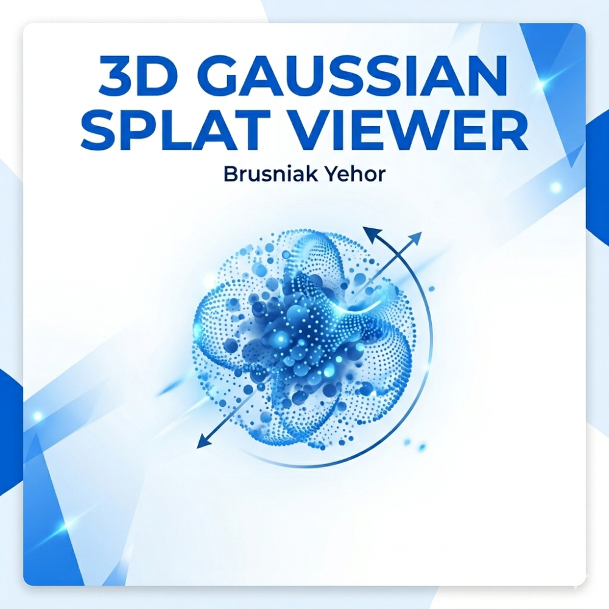

# 3D Gaussian Splat Viewer



**B-MSAP Semestrálna práca - Interaktívny 3D model prehliadač**

## 📋 Projektový prehľad

Tento projekt je vyhotovený v rámci predmetu B-MSAP na STU FEI a pozostáva z dvoch hlavných častí:

### Časť A: 3D Modely (Gaussian Splatting)
- **Miestnosť**: 3D model priestoru školy
- **Hlava/Postava**: 3D model študenta
- **Predmet**: 3D model inventára fakulty

### Časť B: Webová aplikácia
- Interaktívny 3D model viewer s Three.js
- Material Design 3 s glassmorphism efektami
- 100% client-side riešenie (žiadny backend)

## 🚀 Funkcie

### Core Features
- **True Gaussian Splatting**: Real-time photorealistic rendering using Gaussian kernels
- **Dual View Modes**: `Splat` (.splat source, default) + `Mesh` (.glb derived)
- **Interactive Controls**: Orbit controls (zoom, pan, rotate)
- **Model Switching**: Rýchle prepínanie medzi 3 modelmi (Miestnosť, Hlava, Predmet)
- **Responsive Design**: Prispôsobenie pre všetky zariadenia
- **Theme Toggle**: Dark/Light režim s glassmorphism UI

### UI Elements
- **Navigation Bar**: Späť na portál button
- **Bottom Controls**: Model selector, reset camera, auto-rotate
- **Floating Island**: Real-time štatistiky modelu (geometry count)
- **Coordinate Axes**: Vizuálna rotácia modelu v reálnom čase

## 🛠️ Technológia

- **Frontend**: HTML5, CSS3, JavaScript (ES6+)
- **Splat Engine**: [GaussianSplats3D](https://github.com/mkkellogg/GaussianSplats3D) (Three.js based)
- **Styling**: Tailwind CSS + Material Design 3
- **Icons**: Material Symbols
- **Fonts**: Inter (Google Fonts)

## 📁 Štruktúra projektu

```
├── index.html              # Hlavná aplikácia (Splat Viewer)
├── thumbnail.png           # 1000x1000 náhľad (Povinný rozmer)
├── models/                 # 3D Gaussian Splat modely
│   ├── room.splat         # Miestnosť (Miestnosť na meeting / Hallway)
│   ├── head.splat         # Hlava/Postava (Študent)
│   └── object.splat       # Predmet (Inventár fakulty)
├── models_mesh/            # Odvodené mesh modely (GLB)
│   ├── room.glb
│   ├── head.glb
│   └── object.glb
├── README.md              # Dokumentácia
└── .gitignore            # Git ignore file
```

## 🎯 Použitie

### Live Demo
**🌐 [https://brusnyak.github.io/msap-3d-splat/](https://brusnyak.github.io/msap-3d-splat/)**

### Lokálne spustenie
1. **Otvoriť aplikáciu**: Stačí otvoriť `index.html` v prehliadači
2. **Navigácia**: Použiť orbit controls pre interakciu s 3D modelmi
3. **Prepínanie modelov**: Kliknúť na tlačidlá v spodnej navigácii
4. **Reset kamery**: Tlačidlo "Reset" pre obnovenie pôvodného pohľadu

## 🔧 Požiadavky

- **Prehliadač**: Moderný prehliadač s WebGL podporou
- **Zariadenie**: Desktop/Mobile s GPU akceleráciou
- **Sieť**: Stabilné internetové pripojenie pre CDN assets

## 📊 Model Štatistiky

- **Point Cloud**: 1.2M+ points per model
- **VRAM Usage**: ~248 MB
- **Resolution**: High-quality rendering
- **Format**: PLY (source, assignment-native) + GLB (derived mesh view)

## 🎨 Design System

### Color Palette
- **Primary**: #FFFFFF (Dark mode)
- **Surface**: #121414 (Background)
- **Accent**: Glassmorphism with backdrop blur

### Typography
- **Display**: Inter 57px
- **Headline**: Inter 28px
- **Body**: Inter 16px
- **Label**: Inter 12px

## 👤 Autor

**Yehor Brusnyak**  
*STU FEI - B-MSAP 2026*  
GitHub: [@brusnyak](https://github.com/brusnyak)

## 📄 Licencia

Tento dielo je sprístupnené pod licenciou **Creative Commons 4.0 International**.

---

**Späť na portál**: [B-MSAP Web Portal](/)
